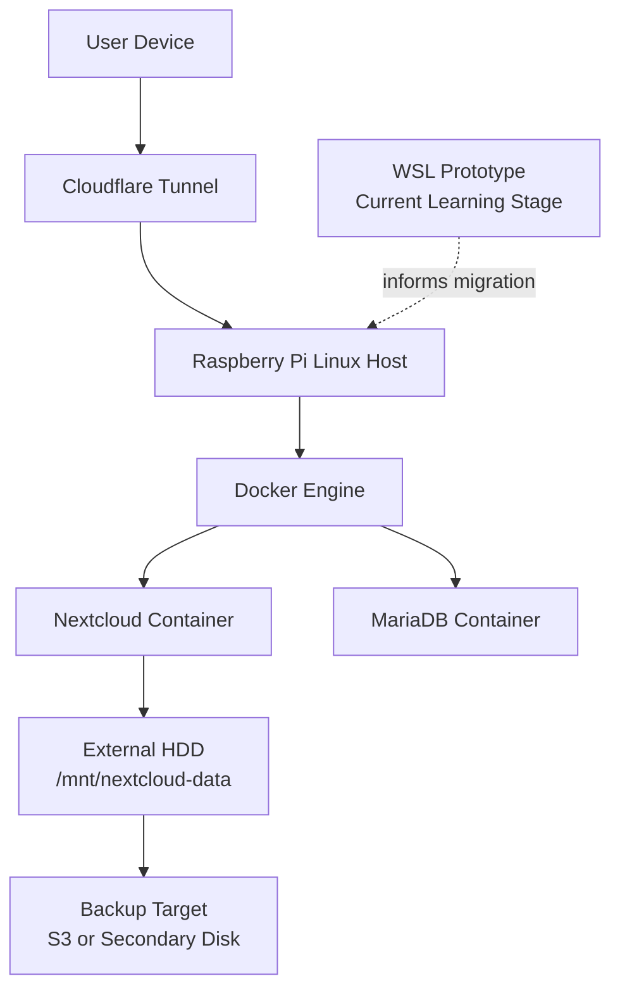

# GitHub Mermaid Architecture Diagram

```mermaid
flowchart TD
    A[User Device] --> B[Cloudflare Tunnel]
    B --> C[Raspberry Pi Linux Host]
    C --> D[Docker Engine]
    D --> E[Nextcloud Container]
    D --> F[MariaDB Container]
    E --> G[External HDD\n/mnt/nextcloud-data]
    G --> H[Backup Target\nS3 or Secondary Disk]
    I[WSL Prototype\nCurrent Learning Stage] -. informs migration .-> C
```
